# openwrt-asusax4200-guide
A step-by-step guide for flashing OpenWrt onto an Asus AX4200 router. [The guide](https://openwrt.org/toh/asus/tuf-ax4200?s[]=root&s[]=latest) provided by OpenWrt 
is already solid, however, it lacks some essential details for beginners. The following guide provides a more detailed step-by-step walkthrough.

## Table of Contents
1. [Required Components](#required-components)  
2. [Hardware Setup](#hardware-setup)  
3. [Preparing OpenWrt Firmware Installation](#preparing-openwrt-firmware-installation)  
4. [Flashing Process](#flashing-process)  
5. [Post-Installation Steps](#post-installation-steps)  
6. [Disclaimer](#disclaimer)  

---

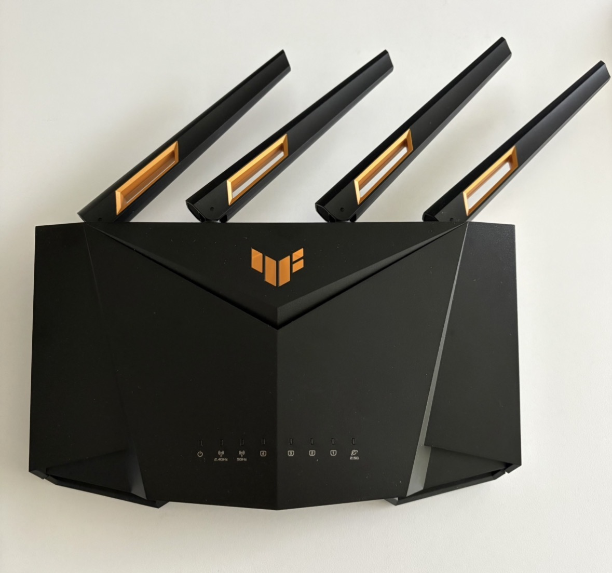

---

## Required Components

| Item                     | Purpose                               | Notes / Link |
|--------------------------|-----------------------------------------|--------------|
| PC with USB-A and RJ45 Port | Used to flash firmware and sysupgrade | |
| Pry tool (or paperclip)  | Opening case | [Video](https://www.youtube.com/watch?v=MVf7xmhXDVc) |
| Crosstip screwdriver  | Opening case | [Video](https://www.youtube.com/watch?v=MVf7xmhXDVc) |
| Ethernet cable           | TFTP and SCP connections | Comes with the router |
| OpenWrt firmware binary    | Base firmware        | Download: [Kernel.bin](https://downloads.openwrt.org/releases/24.10.3/targets/mediatek/filogic/openwrt-24.10.3-mediatek-filogic-asus_tuf-ax4200-initramfs-kernel.bin) (Download newer version if required)|
| OpenWrt sysupgrade binary    | Upgrade        | Download: [Sysupgrade.bin](https://downloads.openwrt.org/releases/24.10.3/targets/mediatek/filogic/openwrt-24.10.3-mediatek-filogic-asus_tuf-ax4200-squashfs-sysupgrade.bin)  (Download newer version if required) |
| USB-to-UART bridge | Assembling a serial connector | e.g., Waveshare's [CP2102 USB UART Board (type A)](https://www.waveshare.com/cp2102-usb-uart-board-type-a.htm)
| Pin headers | Assembling a serial connector | 4-pin male-to-male pin header comes with Waveshare's CP2102
| Breadboard Jumper Wires | Assembling a serial connector | 3x female-to-female
| Terminal          | For serial connection         | e.g., [TeraTerm](https://github.com/TeraTermProject/teraterm/releases) |
| TFTP Server | Used to flash firmware | e.g., [Tftp64](https://github.com/PJO2/tftpd64/releases/)

---

## Hardware Setup

### Opening the case

First, remove the rubber studs on the backside and unscrew the case (4 screws). Use a pry tool or a paperclip to carefully open the case. Watch [this video](https://www.youtube.com/watch?v=MVf7xmhXDVc).

You should then be able to see the motherboard. Do not remove the motherboard from the case. In the right bottom corner you can see the serial port.

<table>
  <tr>
    <th>Screws</th>
    <th>Motherboard</th>
    <th>Serial Port</th>
  </tr>
  <tr>
    <td>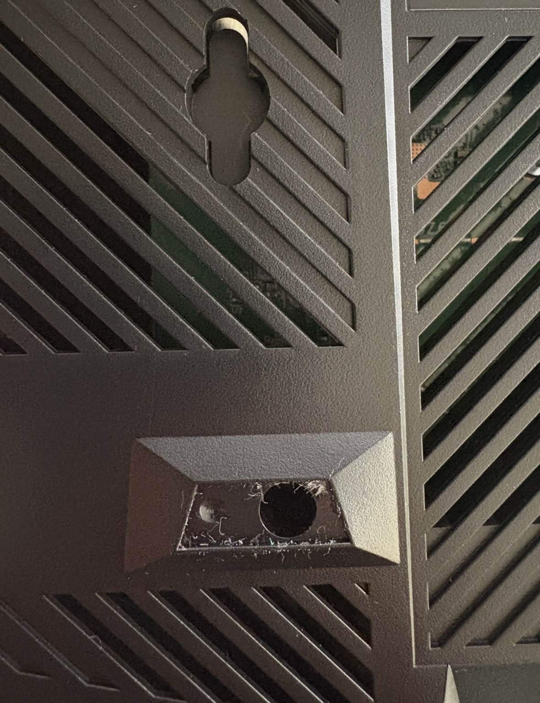</td>
    <td>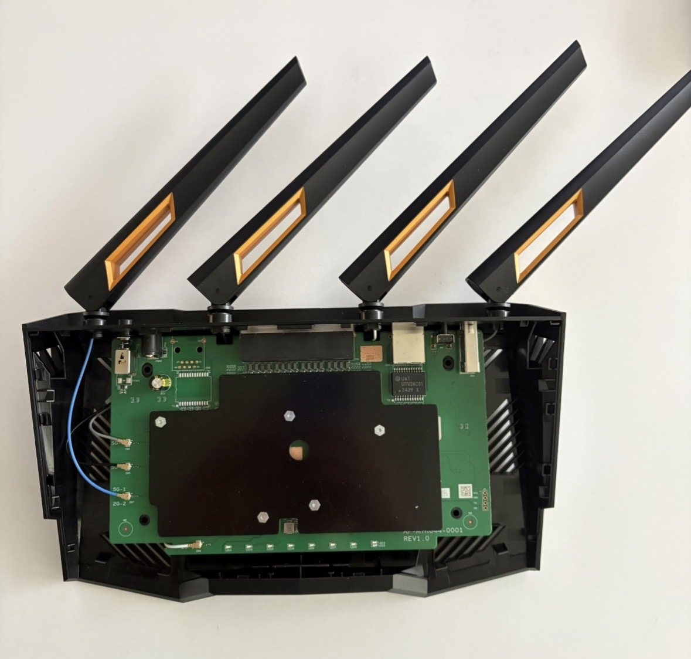</td>
    <td>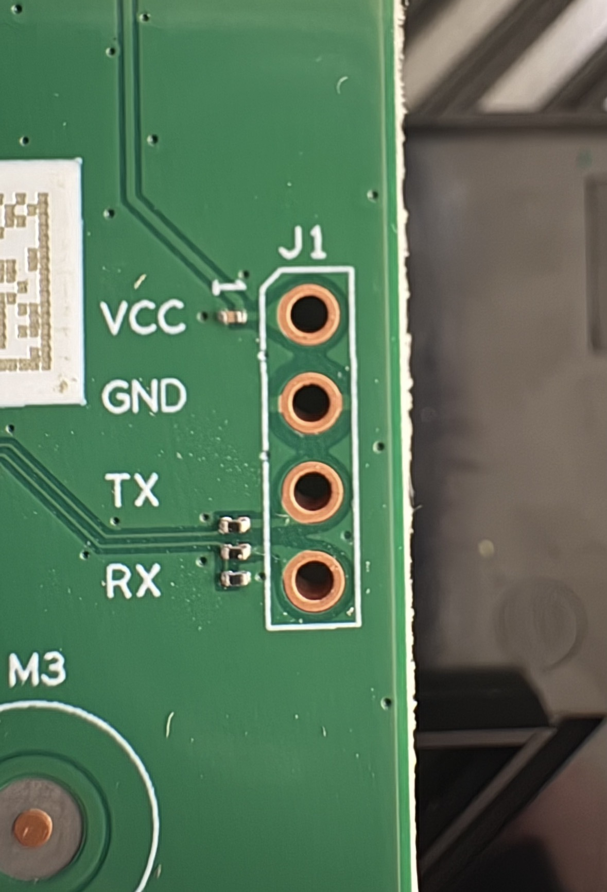</td>
  </tr>
</table>

### Assembling a serial connector

First, you will need a USB-to-UART bridge, such as Waveshare's [CP2102 USB UART Board (type A)](https://www.waveshare.com/cp2102-usb-uart-board-type-a.htm), or equivalent. In addition, you will need a pin headers and breadboard wires.

<table>
  <tr>
    <th>CP2102</th>
    <th>Pin Header Block</th>
    <th>3x Female-to-Female Breadboard Wires</th>
  </tr>
  <tr>
    <td>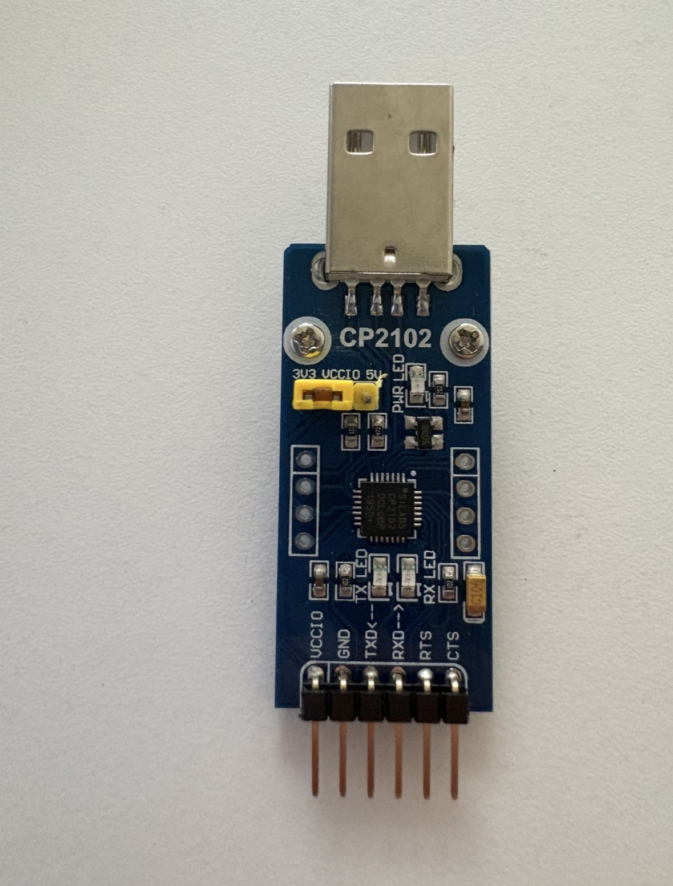</td>
    <td>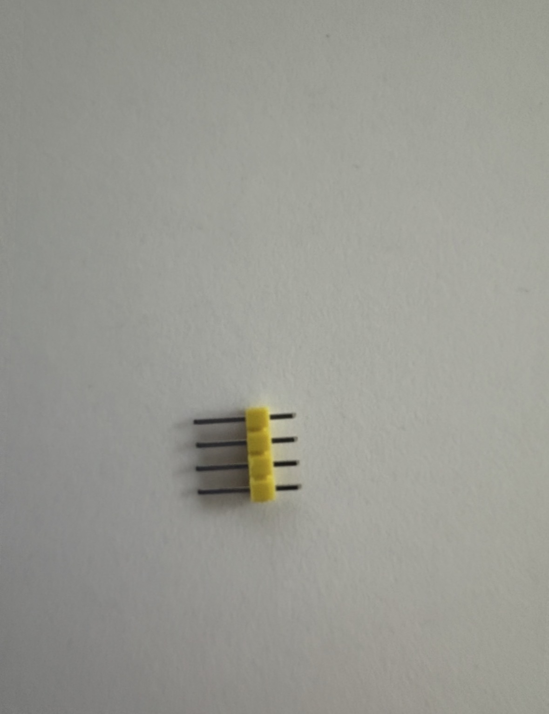</td>
    <td>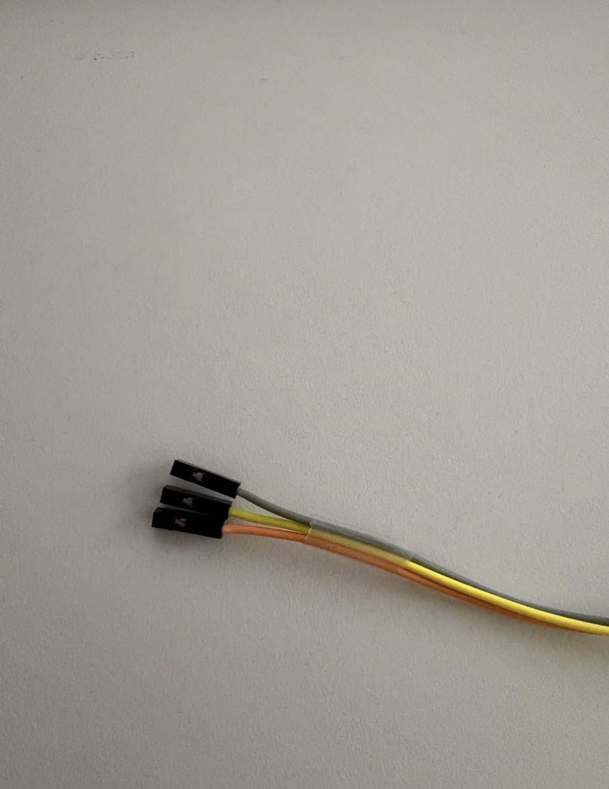</td>
  </tr>
</table>

To assemble the serial connector, attach the wires as follows:

| Pin Number | Connection        |
|------------|-------------------|
| 1          | empty, no VCC needed|
| 2          | GND (CP2102) |
| 3          | RXD (CP2102) |
| 4          | TXD (CP2102) |

<table>
  <tr>
    <th>Pins</th>
    <th>CP2102 Pins</th>
    <th>Attached wires</th>
  </tr>
  <tr>
    <td>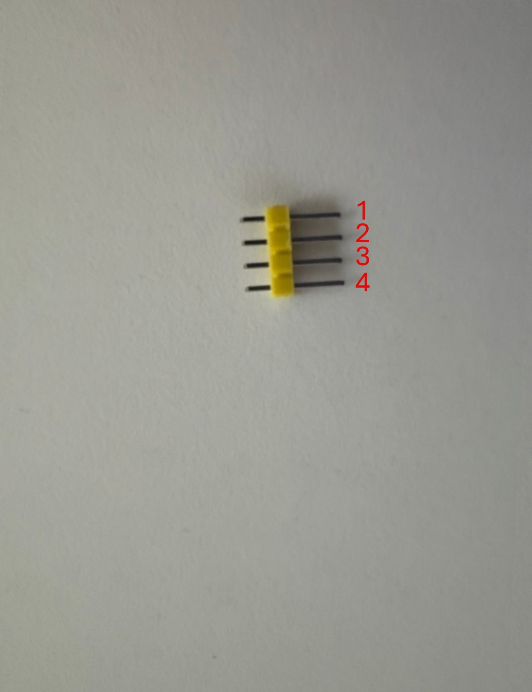</td>
    <td>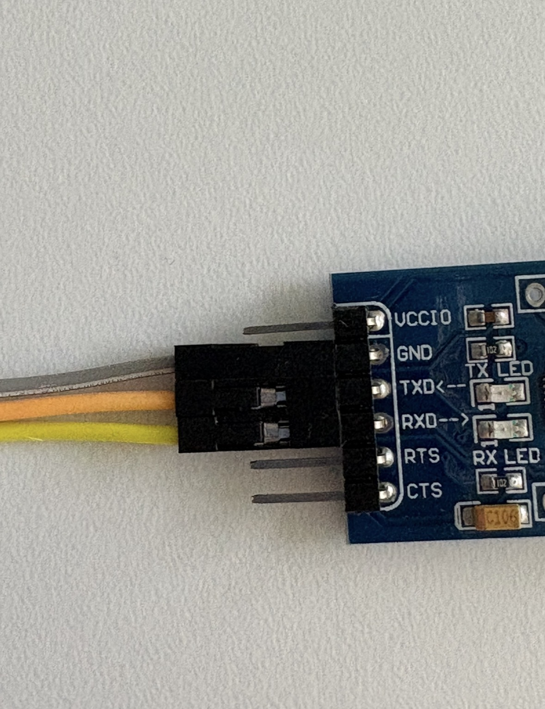</td>
    <td>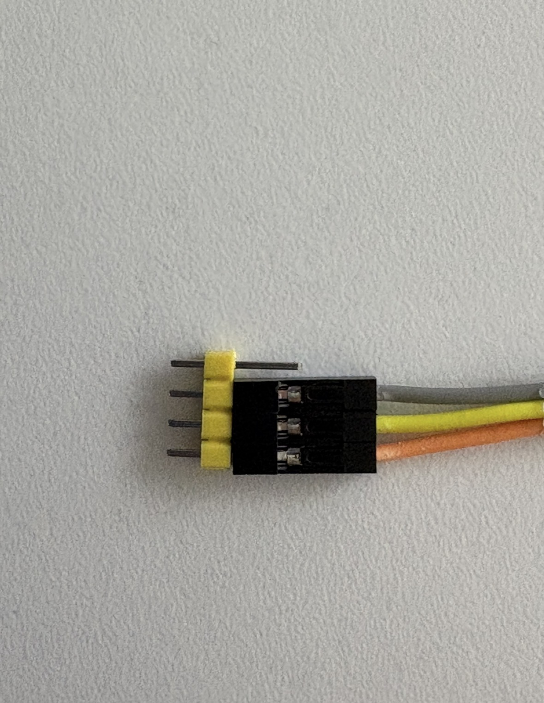</td>
  </tr>
</table>

---

## Preparing OpenWrt Firmware Installation

**Note: If problems arise with the TFTP connection, disable the Windows firewall.**

1. Download the correct firmware and sysupgrade images as per the [Table](#required-components).
2. Download and install a terminal, such as TeraTerm, as per the [Table](#required-components).
3. Download a TFTP server as per the [Table](#required-components).

4. Connect the Ethernet cable to the Router's LAN port 1 and your PC's LAN port.
5. Edit the Ethernet Network Settings in Settings->Network & internet->Ethernet->Edit IP Addresses (as per the image below).

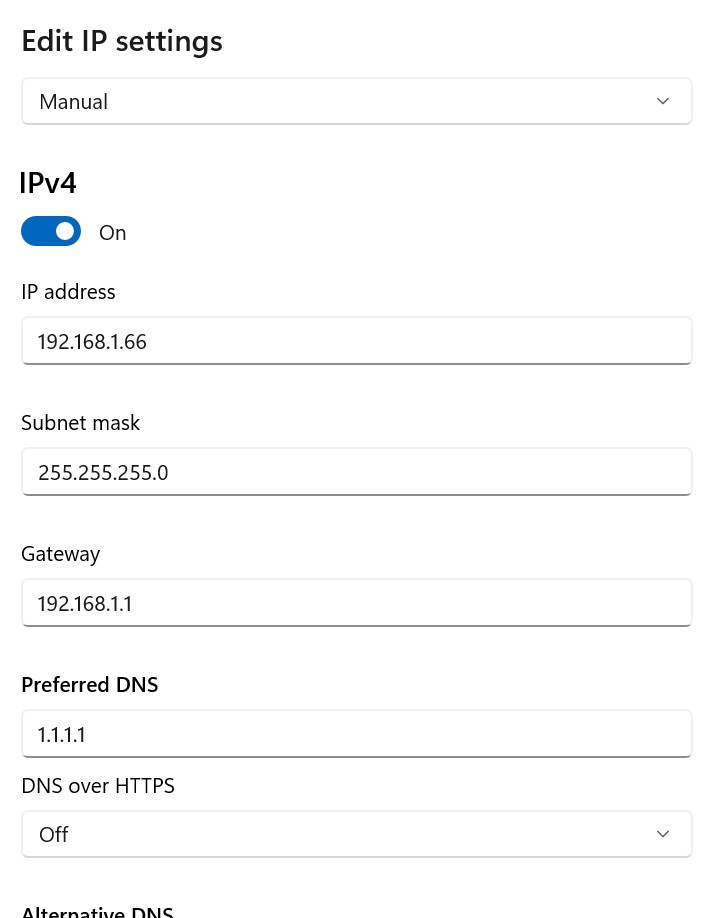

6. Start Ttfpd64 and select the Ethernet network interface (as per the image below).
7. Place the firmware bin file into the TFTP server installation folder (default: C:\Program Files\Tftpd64).
8. Rename the "openwrt-24.10.3-mediatek-filogic-asus_tuf-ax4200-initramfs-kernel.bin" file to  "tufax4200.bin".

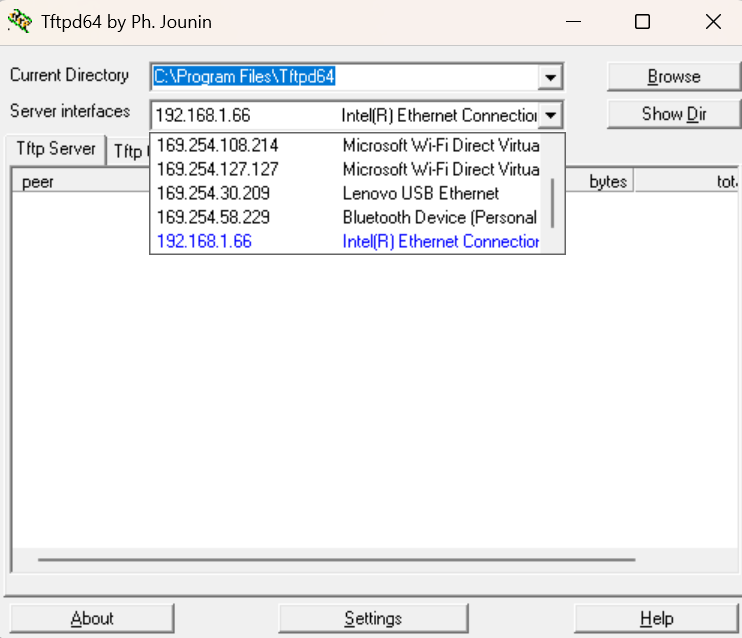

---
 
## Flashing Process

1. Plug the serial cable into your laptop and attach it to the router (as shown below):

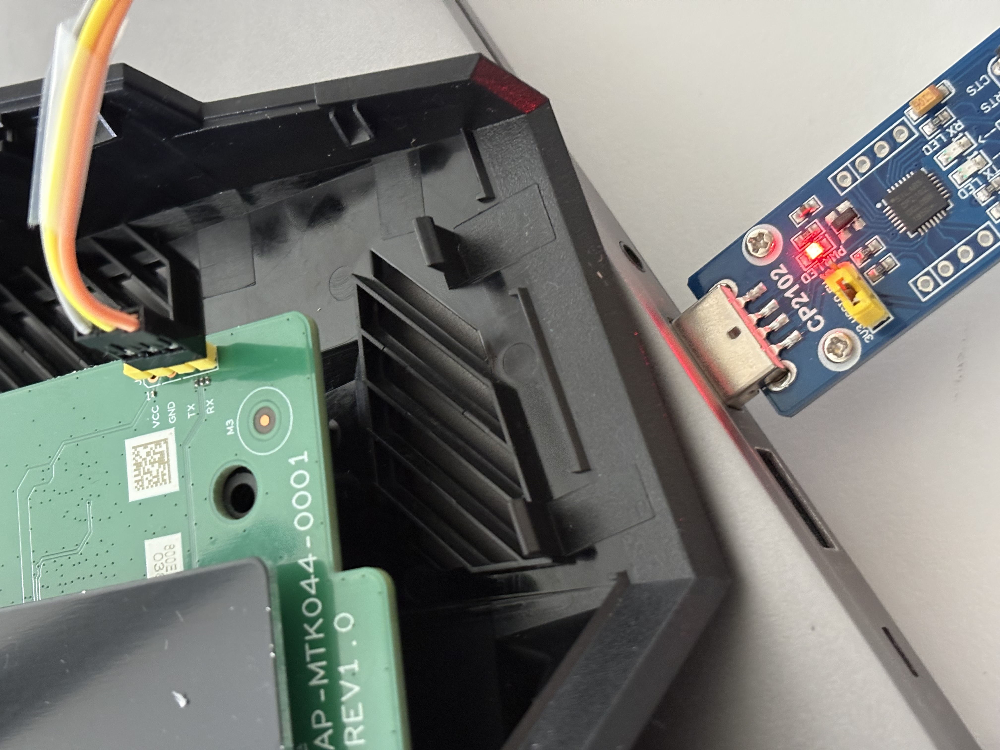

2. Plug in the router and press the power button.
3. Start TeraTerm and activate local echo in Setup->Terminal->Check "Local Echo"
4. Then go to Setup->Serial Port and set the baud rate to 115200. The serial port should be automatically detected by TeraTerm. If that's not the case, you may need to download and install a [Windows driver for the CP2102](https://www.silabs.com/software-and-tools/usb-to-uart-bridge-vcp-drivers?tab=downloads).
5. In TeraTerm, press "4" to interrupt the boot process. If you don't get a "MT7986>" console, restart the router and press "4" again.

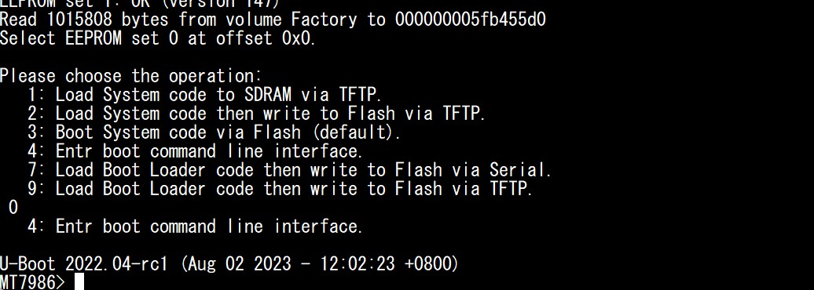

6. In the MT7986 console enter the following commands. This sets the IP address for the router and the TFTP server (your PC), and loads the firmware via TFTP onto the router.

    ``
    MT7986> setenv ipaddr 192.168.1.1
    `` 
    ``
    MT7986> setenv serverip 192.168.1.66
    `` 
    ``
    MT7986> tftpboot 0x46000000 tufax4200.bin
    `` 
    ``
    MT7986> bootm 0x46000000
    `` 

7. Now the firmware image should have been transferred and your router should be able to boot OpenWrt.
8. Open a Windows terminal and verify that you can ping the router at 192.168.1.1
9. If you can ping the router, connect via SSH: `ssh root@192.168.1.1`
10. The OpenWrt base image doesn't include an SCP server, only an SCP client (scp command). Hence, we need fetch the file from the PC.
11. On the PC, open Powershell as admin and run the following commands: 
    ``
    Add-WindowsCapability -Online -Name OpenSSH.Server~~~~0.0.1.0
    `` 
    ``
    Start-Service sshd
    `` 
    ``
    Set-Service -Name sshd -StartupType 'Automatic'
    `` 
12. Make sure your Windows firewall is disabled.
13. Move the sysupgrade file into a directory whose name and path contain no spaces. (e.g., C:\Users\yourusername\Downloads\sysupgrade.bin)
14. Rename the "openwrt-24.10.3-mediatek-filogic-asus_tuf-ax4200-squashfs-sysupgrade.bin" file to "sysupgrade.bin".
15. On the router, run the following command:  
`scp yourusername@192.168.1.66:/Users/yourusername/Downloads/sysupgrade.bin /tmp/`
16. Now you should be able to locate the sysupgrade.bin in the /tmp/ directory on your router.
17. Run `sysupgrade -n /tmp/sysupgrade.bin` on the router.

---

## Post-Installation Steps

After the upgrade, you should be able to reach the OpenWrt LuCI Web Interface by browsing to: http://192.168.1.1/cgi-bin/luci/   (Username: root, Password: root)

---

## Disclaimer
Flashing custom firmware can void your warranty. That's why I put the disclaimer at the end. 

---
